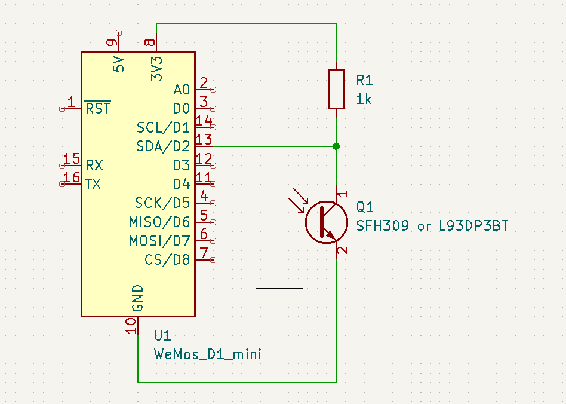
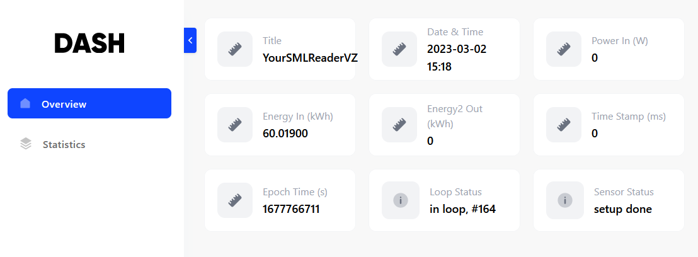

# SMLReaderVZ #

ESP8266 based SML reader to fetch data of (electrical) meters via the optical interface and transfer it to Volkszaehler Middleware.

# Description

## Overview
Receive SML data from an (electrical) meter, evaluate it and send selected data to the middleware
of Volkszaehler (addresses and channel UUIDs configurable).

Evaluation is done in periods defined in structure *SensorConfig SENSOR_CONFIGS*.  
A webserver dashboard is available to show the instantaneous information.  

The build in LED is used for signalling:  
- Setup()
  - On at begin
  - Off before start of conf.init and sensor.init
  - on at end
- Loop()  
  - no switch
- wifi_connected()  
  - Off at begin
- process_message (SML data)  
  - On at begin
  - Off at end

Serial monitor output is available as configured during the build.

## Hardware
The target hardware is an Expressif ESP8266 microprocessor with a simple IR reading head that is attached to the optical interface of an electrical meter.  

### Layout
The hardware layout follows [3], connection PINs are defined in *config.h*.  



## Dash Board


## Configuration

### Web Interface
The program provides a Web Interface for configuration and a small home page.

### Web Access Point (WiFI AP mode)
The program provides a Web Access Point at boot time via http://192.168.4.1/config (or the configured SSID name) using the configured password.  
Note: http://192.168.4.1 will access the Dash Board, not the config page.  
It offers a configuration page both for the Access Point and for a local WLAN SSID name and password.  
Additional customer parameters are supported.  
Configuration is stored in EEPROM.  

At first boot, the defined default password *MY_WIFI_AP_DEFAULT_PASSWORD* (as defined in *config.h*) is used for AP mode access.  
Note: at first boot you need to configure the device: set a new AP password, the WLAN SSID and WLAN password, and push the apply button.
**Disconnect** from the the Access Point to continue and **reset** the device.

If no client connects before the timeout (configured to 30sec), the device will automatically continue in 
STA (station) mode and connect to a local WLAN if configured.  

### Web Interface in a local WLAN (WiFi STA mode)
If the device has already been configured, it will automatically connect to the local WiFi after timeout.  
The device web interface can be reached via the IP address obtained from your local network's DHCP server or the configured SSID name.  
A small home page is provided at *\<localIP\>/start* which offers access to the configuration page as well.  
To login into configuration, provide the user *admin* and the configured AP *password*.  

### Configuration Parameter
The configuration page provides two sections:
- System Configuration: WiFi AP/STA names and passwords
- VZ Settings: volkszaehler server name (or IP), volkszaehler middleware (e.g. middleware.php), uuid of selected data channels (including a channel for test data and a hearbeat channel) and a timezone offset.  
You can switch-off transmission of data by using "null" as uuid (configurable by VZ_UUID_NO_SEND in config.h)
Note: SMLReaderVZ will send data with standard UNIX epochtime (ms) timestamps (ignoring timezone offset).

## Usage
- Just switch on the board.
- Connect to the access point if you need to configure your local WiFi net:  
IP address 192.168.4.1/config (or the specified network name) using your configured AP password.
- A force to AP mode is provided in case of forgotten password:  
Connect *WEBCONF_AP_MODE_CONFIG_PIN* to ground and use *MY_WIFI_AP_DEFAULT_PASSWORD*.  
- Wait for AP timeout and access the home page in your local network:  
accessible by MY_WIFI_AP_SSID (or IP address provided by your DHCP server).
- You can access the configuration page in STA mode by login as *admin* with the configured AP password.

### Serial Monitor Output
The amount of debug output to the serial monitor can be controlled by two DEFINE statements, e.g. given as compiler build flags.  
- *SERIAL_DEBUG=true* provides increased debug output
- *SERIAL_DEBUG_VERBOSE=true* provides output of the complete SML message block sent by the meter device. This allows to check which data is provided by the meter.

## Dash Board
A dash board is acessible both from AP and STA mode.
See https://github.com/ayushsharma82/ESP-DASH.


## Implementation
Using classes  
**Sensor:**      receive data and put it into a buffer  
**SmlHttp:**     transfers data to Volkszaehler data base  
**smlDebug:**    functions for output of sml messages to serial monitor [3]  

Used own libs:  
**confWeb**             configurable web server (derived from [1])  
**libSML**              parse and evaluate SML messages (error correction of [4])  
**ESP-Dash**            Dash Board [5]  

Used 3rd party libs:  
**ArduinoJson**  
**ESP AsyncWebServer**  provide web server on D1 mini  
**ESPAsyncTCP**  
**TimeLib**             date/time functions  

## Dependency Graph V2.0.0 ##
```bash
Dependency Graph
|-- ESP-DASH @ 4.0.1+sha.9431138
|   |-- ESP Async WebServer @ 1.2.3+sha.f71e3d4
|   |   |-- ESPAsyncTCP @ 1.2.2+sha.1547686
|   |   |-- Hash @ 1.0
|   |   |-- ESP8266WiFi @ 1.0
|   |-- ArduinoJson @ 6.20.1+sha.33a4773
|   |-- ESP8266WiFi @ 1.0
|   |-- ESPAsyncTCP @ 1.2.2+sha.1547686
|   |-- Hash @ 1.0
|-- ESPAsyncTCP @ 1.2.2+sha.1547686
|-- ESP Async WebServer @ 1.2.3+sha.f71e3d4
|   |-- ESPAsyncTCP @ 1.2.2+sha.1547686
|   |-- Hash @ 1.0
|   |-- ESP8266WiFi @ 1.0
|-- ArduinoJson @ 6.20.1+sha.33a4773
|-- Time @ 1.6.1+sha.a18e50d
|-- libSML @ 1.0.0+sha.74e18fc
|-- EspSoftwareSerial @ 7.0.0
|-- DNSServer @ 1.1.1
|   |-- ESP8266WiFi @ 1.0
|-- ESP8266WiFi @ 1.0
|-- EEPROM @ 1.0
|-- Hash @ 1.0
|-- confWeb @ 1.0.0
|   |-- ESP Async WebServer @ 1.2.3+sha.f71e3d4
|   |   |-- ESPAsyncTCP @ 1.2.2+sha.1547686
|   |   |-- Hash @ 1.0
|   |   |-- ESP8266WiFi @ 1.0
|   |-- ArduinoJson @ 6.20.1+sha.33a4773
|   |-- EEPROM @ 1.0
|   |-- ESP8266WiFi @ 1.0
|   |-- ESPAsyncTCP @ 1.2.2+sha.1547686
|   |-- Hash @ 1.0
|   |-- DNSServer @ 1.1.1
|   |   |-- ESP8266WiFi @ 1.0
|-- ESP8266HTTPClient @ 1.2
|   |-- ESP8266WiFi @ 1.0
```

# Description Class Sensor #
Class Sensor initializes the serial input PIN and transfers the serial input into a buffer.

## Usage ##
in Setup():
Create a Sensor object, providing the configuration structure and a call back function to process the message  

	Sensor \*sensor = new Sensor(config, process_message);

in Loop():  

	sensor->loop()

## Implementation ##
A state machine is used to
- wait for incoming data by checking for the SML start sequence
- transfer data to the buffer until the end sequence is recognized
- handle the CRC data
- initiate processing of the data using the callback function.

## Used libs ##
SoftwareSerial  

## Details ##
### State machine of Sensor.cpp ###

| Old State            | Event                                            | New State                     |
|:---------------------|:------------------------------------------------:|------------------------------:|
|                      | declaration                                      | 0 INIT                        |  
| 0 INIT               | init_state()                                     | 2 WAIT_FOR_START_SEQ          |  
| 2 WAIT_FOR_START_SEQ | check Read Timeout: no timeout                   | 2 WAIT_FOR_START_SEQ          |  
| 2 WAIT_FOR_START_SEQ | check Read Timeout: timeout, reset_state()       | 0 INIT                        |  
| 2 WAIT_FOR_START_SEQ | start sequence found                             | 3 READ_MESSAGE                |  
| 3 READ_MESSAGE       | END SEQUENCE found                               | 5 READ_CHECKSUM               |  
| 3 READ_MESSAGE       | buffer overflow, reset_state()                   | 0 INIT                        |  
| 5 READ_CHECKSUM      | read checksum                                    | 4 PROCESS_MESSAGE (callback)  |  
| 4 PROCESS_MESSAGE    | pause interval == 0, reset_state()               | 0 INIT                        |  
| 4 PROCESS_MESSAGE    | pause interval != 0, reset_state()               | 1 STANDBY                     |  
| 1 STANDBY            | standby time over, reset_state()                 | 0 INIT                        |  
|______________________|__________________________________________________|_______________________________|

Remark: reset_state() calls init_state() which results in 2 WAIT_FOR_START_SEQ; state INIT is only used during initialisation;

# Description of class SmlHttp #
Perform http transfer of a data tupel (timestamp,value) of a sensor channel to the Volkszaehler data base via middleware.php  
- timestamp is Unix epoch time in seconds.  
- sensor channel is defined by its data base UUID.  

This class replaces class MqttPublisher that was used in https://github.com/mruettgers/SMLReader  as a http server is used instead of an MQTT broker.  
The http implementation follows the example in https://RandomNerdTutorials.com/esp8266-nodemcu-http-get-post-arduino/.

## Usage ##
```bash
myHttp.init(SmlHttpConfig &config)              // initialize class with server name and channel UUIDs
myHttp.postHttp(vzUUID, s_timeStamp, value);    // post value to Volkszaehler
myHttp.publish(sensor, file);                   // evaluate and filter SML file messages and call postHttp()
myHttp.testHttp();                              // create test output and call postHttp()
myHttp.getTimeStamp();                          // returns TimeStamp string
myHttp.getValue(obisValue _select);             // returns selected Obis value of an SML message, valid only with publish()
```
Server name and Volkszaehler channel UUIDs are provided via struct SmlHttpConfig.


## Implementation ##

postHttp():  
For transfer to volkszaehler, the http transfer should look like this:
```bash
http://volkszaehler-server/middleware.php/data.json?uuid=ae53c580-1234-5678-90ab-cdefghijklmn&operation=add&ts=1666801000000&value=22
```

Implementation is done using class HTTPClient.

publish():  
The publish() method evaluates the SML messages of the SML file structure extracting Obis name of channels and the data.  
The timestamp is created locally based on the system time.  
Sensor is only used to extract configuration data (name of meter, numeric flag).

# Description smlDebug.cpp #
smlDebug.cpp implementing debug output of the SML file message structure.

# License
Copyright (C) M. Herbert, 2022-2023.  
Licensed under the GNU General Public License v3.0

# Acknowledgement

This project is based on https://github.com/mruettgers/SMLReader.  
It was adapted for own use with these changes:  
- modularization of code (own cpp instead of monolithic include of code into main.cpp)
- removal of jled usage
- use ESP-Dash (with ESPAsyncWebserver instead of IOTwebserver)
- remove MQTT interface and add http interface to Volkszaehler middleware instead  
- added confWeb for the configuration interface in WiFi AP mode  

# History
see [CHANGELOG.md](http://./CHANGELOG.md)

# References
[1] https://github.com/prampec/IotWebConf  
[2] https://github.com/10k-resistor/Solis4Gmini-logger  
[3] https://github.com/mruettgers/SMLReader  
[4] https://github.com/volkszaehler/libsml  
[5] https://github.com/ayushsharma82/ESP-DASH  
[6] https://RandomNerdTutorials.com/esp8266-nodemcu-http-get-post-arduino/

